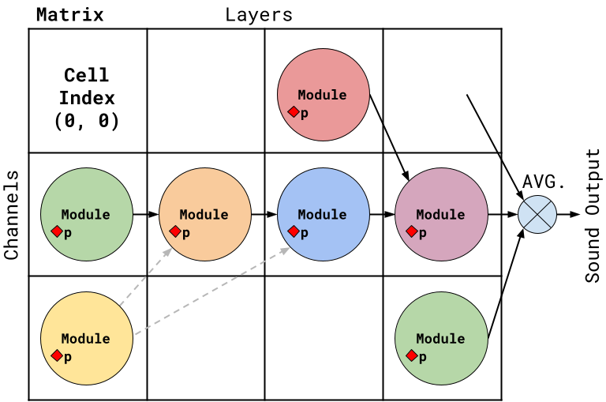

# DiffMoog: A Modular Differentiable Commercial-like Synthesizer



This repo contains the implementation of DiffMoog, a differential, subtractive, modular synthesizer, incorporating standard architecture and sound modules commonly found in commercial synthesizers.

The repo contains code for the synthesizer modules and architecture, as well as a platform for training and evaluating sound matching models using the synthesizer as a basis.

## Paper
https://arxiv.org/abs/2401.12570

## Getting started
To get started, simply clone the repo and install the requirements in requirements.txt, then follow the instructions below.

### Dataset generation

To create a dataset, run the file `src/data/create_data.py` with the following arguments:

- `-g`: the index of the GPU to use
- `-s`: the dataset to create, either `'train'` or `'val'`
- `--size`: the number of samples to create
- `-n`: the name of the dataset
- `-c`: the name of the chain to use from `src/synth/synth_chains.py`
- `-sd`: the signal duration in seconds
- `-no`: the note off time in seconds (the time at which the note is released, equivalent to MIDI note off)
- `-bs`: the batch size (number of samples to create in parallel)

**Example**:

```sh
-g 0 -s train --size 50000 -n reduced_simple_osc -c REDUCED_SIMPLE_OSC -sd 4.0 -no 3.0 -bs 1
```

The dataset will be saved in location root/data/{dataset_name}.

### Model Training

#### Preliminary Conditions

Before you start with the model training, ensure the following preliminary conditions are met:

1. **Dataset Conditions**
   - A dataset has been created in the directory `root/data/{dataset_name}` with four distinct folders: `train`, `val`, `train_nsynth`, and `val_nsynth`. The recommended dataset sizes are:
     - train: 50,000 samples
     - val: 5,000 samples
     - train_nsynth: 18,000 samples
     - val_nsynth: 2,000 samples

   - The `train` and `val` folders are populated automatically by the `create_data.py` script as described in the dataset generation section above. This script generates several files inside these folders including `{sound_id}.wav`, `commit_and_args.txt`, `params_dataset.csv`, and `params_dataset.pkl`.

   - The `val_nsynth` and `train_nsynth` folders need to be manually created by the user and should contain the NSynth dataset. Place the `.wav` files inside a subfolder named `wav_files`. You can use the notebook `root/misc_notebooks/get_nsynth_dataset.ipynb` to assist with this process.

2. **Configuration File**
   - There is a configuration file available (probably at `root/configs/{config_name}.yaml`) that contains the model configuration settings. Refer to the example configuration file `root/configs/example_config.yaml` for an explanation of the different fields and options.

#### Directory Structure

The directory structure should resemble the hierarchy below:


```plaintext
root/
└── data/
    └── {dataset_name}/
        ├── train/                 # Generated by create_data.py script
        │   ├── wav_files/         
        │   │   └── {sound_id}.wav  # Generated files
        │   ├── commit_and_args.txt  # Generated files
        │   ├── params_dataset.csv   # Generated files
        │   └── params_dataset.pkl   # Generated files
        ├── val/                   # Generated by create_data.py script
        │   ├── wav_files/         
        │   │   └── {sound_id}.wav  # Generated files
        │   ├── commit_and_args.txt  # Generated files
        │   ├── params_dataset.csv   # Generated files
        │   └── params_dataset.pkl   # Generated files
        ├── val_nsynth/
        │   └── wav_files/
        │       └── {sound_id}.wav
        └── train_nsynth/
            └── wav_files/
                └── {sound_id}.wav
```


#### Training

To train the model, execute the `src/main.py` script with the following arguments:

- `-g`: The index of the GPU to use.
- `-e`: The name of the experiment, for the purposes of storing results and TensorBoard logging. The experiment data will be stored in `root/experiments/{experiment_name}`.
- `-d`: The dataset to use, specified by the name of the dataset folder in `root/data/{dataset_name}`.
- `-c`: The path to the configuration file, e.g., `root/configs/{config_name}.yaml`.
- `--seed`: seed number to use (optional).

**Example**:

```sh
-g 0 -e params_only -d modular_chain_dataset -c root/configs/paper_configs_reduced/params_only_config.yaml
```

### Paper

The paper is available in the repository at `root/paper.pdf`.
Supplementary material is at `root/paper_supplementary`.

### Notebooks

In the *examples* directory, you will find several notebooks to help get you familiar with the DiffMoog synthesizer and its capabilities.

Start with `explore_chains.ipynb` and `create_dataset.ipynb` for introduction about the synth structure, configuration and sound generation.

Use `train_model.ipynb` and `evaluate_model.ipynb` to train and evaluate a sound matching model.
